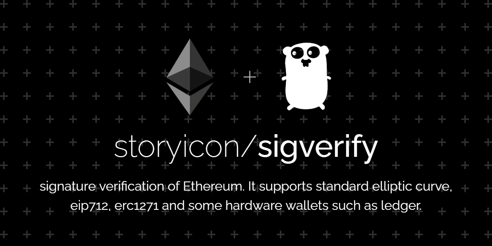

# SigVerify

[](https://pkg.go.dev/github.com/storyicon/sigverify?tab=doc)
[](https://goreportcard.com/report/github.com/storyicon/sigverify)



This project is used to verify signatures under various specifications of ethereum. In addition to the standard elliptic curve signature, it also supports the signature of wallets such as ledger and argent.

It supports:
1. Standard elliptic curve signature verification. (eth_sign).
2. [EIP712](https://eips.ethereum.org/EIPS/eip-712) typed data verification. (eth_signTypedData_v*).
3. [ERC1271](https://eips.ethereum.org/EIPS/eip-1271) Smart contract wallet signature verification (isValidSignature).
4. Some hardware wallets signature verification such as `ledger`.

## Examples

### 1. Standard elliptic curve signature verification

```cgo
package main

import (
	"fmt"

	ethcommon "github.com/ethereum/go-ethereum/common"
	"github.com/storyicon/sigverify"
)

func main() {
	valid, err := sigverify.VerifyEllipticCurveHexSignatureEx(
		ethcommon.HexToAddress("0xb052C02346F80cF6ae4DF52c10FABD3e0aD24d81"),
		[]byte("hello"),
		"0x0498c6564863c78e663848b963fde1ea1d860d5d882d2abdb707d1e9179ff80630a4a71705da534a562c08cb64a546c6132de26eb77a44f086832cbc1dbe01f71b",
	)
	fmt.Println(valid, err) // true <nil>
}
```

### 2. EIP-712 Typed data verification

```cgo
package main

import (
	"encoding/json"
	"fmt"

	ethcommon "github.com/ethereum/go-ethereum/common"
	"github.com/ethereum/go-ethereum/signer/core/apitypes"
	"github.com/storyicon/sigverify"
)

const ExampleTypedData = `
{
    "types": {
        "EIP712Domain": [
            {
                "name": "name",
                "type": "string"
            },
            {
                "name": "chainId",
                "type": "uint256"
            }
        ],
        "RandomAmbireTypeStruct": [
            {
                "name": "identity",
                "type": "address"
            },
            {
                "name": "rewards",
                "type": "uint256"
            }
        ]
    },
    "domain": {
        "name": "Ambire Typed test message",
        "chainId": "1"
    },
    "primaryType": "RandomAmbireTypeStruct",
    "message": {
        "identity": "0x0000000000000000000000000000000000000000",
        "rewards": 0
    }
}
`

func main() {
	var typedData apitypes.TypedData
	if err := json.Unmarshal([]byte(ExampleTypedData), &typedData); err != nil {
		panic(err)
	}
	valid, err := sigverify.VerifyTypedDataHexSignatureEx(
		ethcommon.HexToAddress("0xaC39b311DCEb2A4b2f5d8461c1cdaF756F4F7Ae9"),
		typedData,
		"0xee0d9f9e63fa7183bea2ca2e614cf539464a4c120c8dfc1d5ccc367f242a2c5939d7f59ec2ab413b8a9047de5de2f1e5e97da4eba2ef0d6a89136464f992dae11c",
	)
	fmt.Println(valid, err) // true <nil>
}
```

### 3. EIP1271 Smart contract wallet signature verification

```cgo
package main

import (
	"context"
	"fmt"

	ethcommon "github.com/ethereum/go-ethereum/common"
	"github.com/ethereum/go-ethereum/ethclient"
	"github.com/storyicon/sigverify"
)

func main() {
	client, err := ethclient.Dial("https://polygon-rpc.com")
	if err != nil {
		panic(err)
	}
	valid, err := sigverify.VerifyERC1271HexSignature(
		context.Background(),
		client,
		ethcommon.HexToAddress("0x4836A472ab1dd406ECb8D0F933A985541ee3921f"),
		[]byte{120, 113, 119},
		"0xc0f8db6019888d87a0afc1299e81ef45d3abce64f63072c8d7a6ef00f5f82c1522958ff110afa98b8c0d23b558376db1d2fbab4944e708f8bf6dc7b977ee07201b00",
	)
	fmt.Println(valid, err) // true <nil>
}
```

## Contribution

Thank you for considering to help out with the source code! Welcome contributions
from anyone on the internet, and are grateful for even the smallest of fixes!

If you'd like to contribute to this project, please fork, fix, commit and send a pull request
for me to review and merge into the main code base.

Please make sure your contributions adhere to our coding guidelines:

* Code must adhere to the official Go [formatting](https://golang.org/doc/effective_go.html#formatting)
  guidelines (i.e. uses [gofmt](https://golang.org/cmd/gofmt/)).
* Code must be documented adhering to the official Go [commentary](https://golang.org/doc/effective_go.html#commentary)
  guidelines.
* Pull requests need to be based on and opened against the `master` branch.

